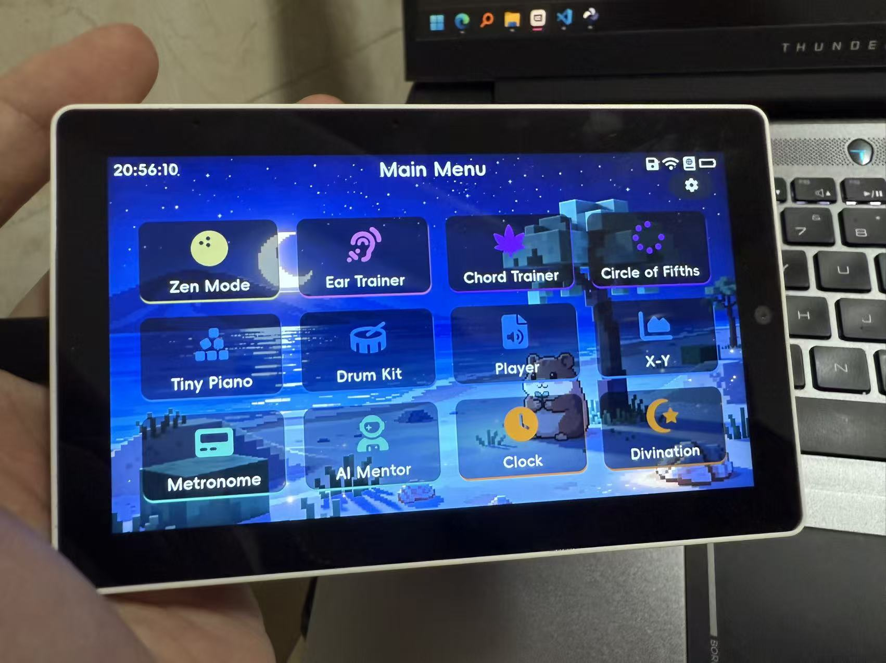

# M5MusicTab5 — 音乐探索终端

[]()
[]()
[]()
[]()
[]()
[]()

🔥 **免安装在线烧录：[fangbrbr.github.io/M5MusicTab5](https://fangbrbr.github.io/M5MusicTab5)**

> 这不是一台平板——这是从零写固件做的音乐探索终端。
>
> 基于 M5Stack Tab5 (ESP32-P4)，从一块光秃秃的开发板到 12 个 App 的完整固件，全部自己写。

📺 **[点击观看项目演示视频](https://www.bilibili.com/video/BV1A7ua6WEH8/?vd_source=8ba75bd77d963d57d4899a8640a77889&p=2&spm_id_from=333.788.videopod.episodes)**

[](https://www.bilibili.com/video/BV1A7ua6WEH8/?vd_source=8ba75bd77d963d57d4899a8640a77889&p=2&spm_id_from=333.788.videopod.episodes)

---

## 特性

- **12 个内置 App** — 禅模式 / 练耳 / 和弦练习 / 五度圈 / 小钢琴 / 组鼓 / MIDI 播放器 / XY Pad / 节拍器 / AI 语音助手 / 时钟日历 / 趣味抽卡
- **SF2 采样合成器** — 基于 SoundFont 2 的真实乐器采样合成
- **全局 MIDI 总线** — 支持 USB Host、蓝牙、UART 多路 MIDI 输入，生产者/消费者解耦架构
- **演奏录制与回放** — 支持录制的 App 点击录制按钮开始、再点停止；演奏以 .hmr（MIDI 事件流）存入 SD 卡，MIDI 播放器中一键回放
- **FTP 无线文件管理** — 设置页一键开启，免拔卡免接线，局域网内用 FileZilla / 资源管理器直接管理 SD 卡全部文件（传 MIDI 曲、取演奏录音、换 SoundFont 音色）
- **EEZ Studio 可视化 UI** — 前后端完全隔离，所见即所得的界面设计
- **小智 AI 语音 + MCP 设备控制** — 语音对话 + 设备控制（亮度/音量/主题/启动 App）
- **实时时钟 + 联网功能** — 天气/新闻/农历/黄历

---

## 硬件

| 项目 | 规格 |
|---|---|
| 主控 | ESP32-P4，双核 RISC-V @ 360 MHz |
| 无线 | ESP32-C6（Wi-Fi + Bluetooth 5，SDIO 透传） |
| 内存 | 32 MB PSRAM |
| 存储 | 16 MB Flash + microSD 卡槽 |
| 显示 | 5 寸 ST7123 电容触摸屏，1280×720（MIPI-DSI） |
| 音频 | ES8388 DAC + ES7210 双麦 AEC，44.1 kHz |
| 接口 | USB-C OTG、USB-A Host、3.5mm 耳机、RS485 |
| 传感器 | BMI270 六轴 IMU |

---

## 12 个 App 用法说明

### 1. 禅模式 (Zen Mode)

专注与放松工具，弹珠碰撞或雨滴下落触发音符。

**使用方法：**
- 顶部三个下拉框选择：
  - **模式**：弹珠 / 雨滴
  - **调式**：大调 / 国风五声 / 小调 / 日式小调
  - **参数**：弹珠模式 5 档速度 / 雨滴模式 1~5 个同时
- **弹珠模式**：点画布放球（最多 4 个），小球在活动区匀速反弹，撞墙触发对应音高的音符
- **雨滴模式**：自动从顶部落下雨滴，撞墙反弹后跌出画布销毁
- 球与球之间有相互引力，轨迹会弯曲
- 音墙分段对应不同音高，按所选调式选取音符
- 支持录制

---

### 2. 练耳 (Ear Trainer)

乐理听音训练工具，支持绝对音感和相对音感两种模式，带难度分级。

**背景知识：**
- **音名**：音高的名字，A B C D E F G，对应固定的频率
- **标准音 A = 440 Hz**：国际通用的音高标准，A4 音的振动频率为 440 次/秒
- **十二平均律**：将一个八度平均分成 12 个半音，每个半音频率比为 2^(1/12)。这是数学上的妥协而非物理上的自洽——纯律中各音程是完美整数比，但转调不方便；十二平均律牺牲了每个音程的纯净度，换取了自由转调的能力
- **绝对音感**：听到一个音就能说出它的音名
- **相对音感**：给出一个参考音后，判断另一个音与参考音的音程关系

**使用方法：**
- 主界面选择：训练模式（绝对/相对音感）、难度（易/中/难）、练习/挑战模式
- 点击「播放」听音
- 绝对音感模式：点 12 键钢琴矩阵作答
- 相对音感模式：点音程按钮作答
- 点重听按钮可再听一次
- **练习模式**：先展示答案再出题，无惩罚
- **挑战模式**：3 条命，答错扣血，耗尽后 3 秒重开
- 历史最高分按模式 × 难度分 6 组持久化保存
- 支持录制

---

### 3. 和弦练习 (Chord Trainer)

和弦学习工具，双八度卷帘标注和弦内音，支持转位设计。

**什么是和弦：**
三个或三个以上不同音高的音，按一定的音程关系叠置在一起，就叫做和弦。最常见的是三和弦（根音+三音+五音）和七和弦。

**使用方法：**
- 12 键根音矩阵点击切换根音
- 15 种和弦类型按钮点选切换：大三 / 小三 / 增三 / 减三 / 挂二 / 挂四 / 大七 / 大小七 / 小七 / 半减七 / 减七 / 挂二七 / 挂四七 / 加九 / 九和弦
- Canvas 绘制双八度钢琴卷帘，标注和弦内音（根音着重）
- **点击画布可切换柱式 / 分解播放**
- 显示和弦名与音程堆叠定义文本
- **跨两个八度的卷帘指示**，非常方便做和弦转位设计

---

### 4. 五度圈 (Circle of Fifths)

乐理可视化工具，一图看懂调式、和弦、转调关系。

**使用方法：**
- 点击五度圈 Canvas 上的扇区，切换 12 个调号
- 顺时针走是升号调（每步增加一个升号），逆时针走是降号调
- 显示：调名、调号（如 1# / 3b）、关系小调、平行小调、音阶拼写
- 点击下方钢琴 Canvas，可试听当前调的上行音阶（8 个音，200ms 步长）

---

### 5. 小钢琴 (Tiny Piano)

3 行 5 列矩阵模式 + 钢琴键模式，最多 5 指多点触控。

**使用方法：**
- 点击格子 / 琴键即可发声
- 点击右上角设置按钮进入设置面板：
  - **显示类型**：矩阵模式 / 钢琴模式（双八度琴键）
  - **音阶类型**：大调 / 大调五声 / 小调 / 小调五声 / 日本都节
  - **根音音名**：13 档可调
  - **钢琴音色**：16 种 SF2 乐器音色
  - **起始八度**：C0 ~ C6 滚轮选择
- 点击录制按钮可录制演奏

---

### 6. 组鼓 (Drum Pad)

虚拟鼓组 + 鼓垫矩阵两种布局，最多 5 指多点触控。

**使用方法：**
- 直接点击鼓垫发声，全部走 MIDI 第 10 通道 GM 鼓映射
- 点击右上角设置按钮切换：
  - **布局**：虚拟鼓组（Canvas 绘制 8 个圆形鼓垫）/ 鼓垫矩阵（2×4 8 按钮）
  - **鼓组音色**：9 种 GM 鼓组
- 支持录制
- 底鼓、军鼓、踩镲（闭合/张开）、嗵鼓（高/中/低）、叮叮镲全部有

---

### 7. MIDI 播放器 (MIDI Player)

标准 MIDI 文件 + 录音文件播放工具。

**使用方法：**
- 左侧列表点选文件
- 右侧控制：上一曲 / 播放停止 / 下一曲
- 进度条可拖动跳转
- 显示：曲名、路径、通道数、BPM、进度、时间
- 点击右上角设置切换播放类型：
  - **MIDI 音乐**：扫描 SD 卡 `/sdcard/midi` 目录的 .mid 文件
  - **录音文件**：扫描 SD 卡 `/sdcard/record` 目录的 .hmr 录音文件
- 所有支持录制的 App（小钢琴、组鼓、XY Pad、禅模式、练耳）录制出的文件，都可以在这里切换到「录音文件」模式查看并播放

---

### 8. XY Pad

连续音高控制的演奏模式，最多 3 指同时演奏，支持弯音滑音。

**使用方法：**
- 手指在触摸板上滑动，X 轴控音高（左低右高）、Y 轴控音量（上大下小）
- 最多 3 指同时演奏，各占独立 MIDI 通道
- Pitch Bend 连续滑音（弯音范围 ±24 半音），弯音窗内滑动只发弯音不重触发
- 3 个 LED 控件指示触点位置
- 点击右上角设置按钮：
  - **音色**：28 种 GM 乐器
  - **音高曲线**：二胡琴杆弦长定律 / 线性均匀
- 支持录制

---

### 9. 节拍器 (Metronome)

专业节拍器，多种调速方式和音色。

**使用方法：**
- 点击播放/停止按钮启停
- **调速方式**：
  - BPM 加减按钮微调
  - 滑块粗调
  - TAP 测速（按节奏点击 TAP 按钮自动计算 BPM）
- 16 个节拍灯逐拍点亮，首拍为重拍灯
- 点击右上角设置按钮：
  - **BPM 范围**：20 ~ 300
  - **拍号**：分子 1~16 / 分母 4/6/8/16/32
  - **音色**：7 种（标准 / 指针式 / 木鱼式 / 鼓组式 / 打击乐式 / 体感式 / 2/4 强弱式）
- BPM / 拍号 / 音色自动保存

---

### 10. AI 语音助手 (AI Agent)

基于小智协议的语音对话 + 设备控制。

**使用方法：**
- 唤醒方式：说唤醒词「Hi 喵喵」，或按住说话按钮说话、松手发送
- 聊天气泡流式展示对话历史
- 支持设备控制：调节亮度、调节音量、切换主题、打开 / 关闭 App 等（MCP 协议）
- 对话历史最多 20 条
- 未绑定时显示 6 位激活码，引导去 xiaozhi.me 绑定

- 点击右上角设置：
  - 对话落盘开关（保存到 SD 卡 ai_chat.txt）
  - 全局唤醒开关（需先在 xiaozhi.me 完成绑定激活，未激活时无法开启）
  - 重置设备绑定

---

### 11. 时钟日历 (Clock & Calendar)

三个功能界面：天气新闻时钟 / 月历黄历 / 定时器。

**使用方法：**
- 点击右上角设置按钮进入设置，底部三个按钮切换面板：时钟 / 月历 / 定时器

**天气新闻时钟：**
- 大字体显示当前时间
- 联网自动获取实时天气
- 底部滚动新闻 + 一言（30 分钟自动刷新）
- 新闻面板自动显隐轮换（10s 显示 / 5s 隐藏）

**月历 + 农历黄历：**
- 点击日期切换选中
- 黄历面板点击翻页（共 4 页）
- 显示：农历日期、宜忌、干支、节气、星宿、冲煞、纳音

**定时器：**
- 加减按钮和快捷按钮（1/3/5/10/20/30/40/50/60 分钟）设置时长
- 开始 / 暂停控制
- 到点响铃提醒

- 设置项：12/24 小时制、时间字体

---

### 12. 趣味抽卡 (Fun / 答案之书 + 塔罗牌)

答案之书和塔罗牌，IMU 翻转触发，带灵能系统。

**使用方法：**
1. 点击右上角设置按钮进入设置，底部按钮切换模式：答案之书 或 塔罗牌
2. 在心里默念你的问题
3. 将设备整个翻过去扣住（屏幕朝下）→ 再翻回来
4. 答案 / 牌面就会显示出来
5. 答案之书：一句话答案
6. 塔罗牌：抽取 3 张牌，带正逆位；**点击牌面可查看牌意解释**

**灵能系统：**
- 顶部显示「灵能」值，每天自动刷新到 100%
- 每次抽取会随机消耗灵能（10~50）
- 当天灵能耗完就不能再抽了，等第二天刷新

---

## FTP 无线文件管理

设备内置 FTP 服务器，SD 卡整卡内容可通过局域网无线管理：给 MIDI 播放器传曲、取回演奏录音（.hmr）、替换 SoundFont 音色，全程免拔卡、免接线。

**使用方法：**
1. 确保设备已连接 Wi-Fi（状态栏出现 📶）
2. 进入 设置 → 高级设置 → FTP 文件传输，页面显示 `ftp://<设备IP>` 与账号密码（均为 `musicpad`）
3. 电脑与设备在同一局域网，用 FileZilla / WinSCP / Windows 资源管理器地址栏输入该地址即可连接
4. 传输中页面实时显示状态、文件名与进度；页面独占系统（不熄屏、语音助手暂停、无法切走）
5. 点「退出」按钮随时主动断开并返回设置页

**说明：**
- 仅支持被动模式（PASV/EPSV），FileZilla / WinSCP / 资源管理器默认即可连
- 仅面向路由器下的本地局域网；FTP 为明文协议、固定凭据，请勿暴露公网
- 支持断点续传（REST）、文件与目录的上传 / 下载 / 删除 / 重命名 / 新建
- 上传进度按已传字节数与活跃指示显示（协议无法预知上传文件大小）；下载按百分比显示
- 仅在 FTP 页面打开期间监听 21 端口，退出即关闭

---

## 状态栏图标

屏幕右上角的状态栏实时指示设备状态，图标仅在对应功能就绪 / 已连接时出现，未出现时即为未连接。按从左到右的排列顺序：

| 图标 | 含义 | 出现条件 |
|:---:|:---|:---|
| 💾 | SD 卡 | microSD 卡已挂载（录制、MIDI 播放、对话落盘等功能依赖 SD 卡） |
| 📶 | Wi-Fi | 已成功连接 Wi-Fi 网络 |
| 🤖 | 小智 AI | AI 助手设置中已开启「全局唤醒」（开启前需先在 xiaozhi.me 完成绑定激活） |
| 🎧 | 耳机 | 3.5mm 耳机已插入 |
| 🔌 | USB MIDI | USB-A 口已接入 MIDI 设备（键盘 / 控制器），接入后可直接演奏所有 App |
| 🔋 | 电池 | 5 档电量指示；充电中（USB 供电）显示满格；未装电池时显示空电池 |

> 设备上实际显示的是 Font Awesome 字形图标，上表用相近 emoji 示意。

---

## 编译环境

基于 VS Code + ESP-IDF 插件开发，ESP-IDF 版本 5.4.4。

---

## 构建与发布

本项目使用 **GitHub Actions** 自动构建。推送到 `v*` 标签时自动触发：

1. 使用 `espressif/idf:v5.4.4` 容器构建固件
2. 输出两个镜像：
   - `0x0_full_*.bin` — 整片 16 MB，首次烧录 / 救砖用（会清空设置）
   - `0x10000_app_*.bin` — 仅应用固件，日常升级用（保留 NVS 设置）
3. 自动创建 GitHub Release 并上传固件

手动触发：进入 GitHub 仓库 → Actions → Build and Release → Run workflow

### 烧录说明

#### 第一次拿到板子 / 全新烧录
下载 `xxx_full_16MB.bin`，用 [ESP Flash Download Tool](https://www.espressif.com/zh-hans/support/download/other-tools)
从 **0x0** 整片烧录即可。也可以命令行：

```bash
esptool.py --chip esp32p4 -p COMx write_flash 0x0 xxx_full_16MB.bin
```

> ⚠️ 整片烧录会清空所有设置（Wi-Fi 配置、校准参数等），恢复出厂状态。

#### 已经烧过旧版本，只想升级固件（推荐）
下载 `xxx_app.bin`，只刷应用区，**你的所有设置都会保留**：

```bash
esptool.py --chip esp32p4 -p COMx write_flash 0x10000 xxx_app.bin
```

#### 救砖
烧不进去、起不来 → 回到第一种方法，整片重烧。

---

## 架构概览

```
┌─────────────────────────────────────┐
│  UI Frontend (EEZ Studio + LVGL)    │
├─────────────────────────────────────┤
│  App Layer（12 个 App）             │
├─────────────────────────────────────┤
│  App Manager（生命周期、路由）       │
├─────────────────────────────────────┤
│  Task Layer（调度、胶水）            │
├─────────────────────────────────────┤
│  Services（音频、Wi-Fi、USB 等）     │
├─────────────────────────────────────┤
│  Engines（MIDI、SF2、GUI 等）        │
├─────────────────────────────────────┤
│  BSP（M5Stack Tab5）                │
└─────────────────────────────────────┘
```

**核心设计：**
- **MIDI 事件总线**：所有 App 的发声、外部 MIDI 输入统一走总线分发，生产者/消费者解耦
- **UI 前后端隔离**：EEZ Studio 做视觉，C 代码做业务，通过控件名绑定
- **分层架构**：严格的层间依赖规则，保证代码可维护性

---

## 目录结构

```
├── components/
│   ├── app_*/              # 12 个 App
│   ├── app_manager/        # App 管理器
│   ├── engine_*/           # 引擎层（gui、midi、sf2）
│   ├── service_*/          # 服务层（audio、wifi、usb、xiaozhi 等）
│   └── task_*/             # 任务层
├── main/                   # 入口
├── tools/                  # 辅助脚本
├── doc/                    # 文档
└── CMakeLists.txt
```

---

## 致谢 / 参考项目

本项目在开发过程中参考和使用了以下开源项目，在此表示感谢：

### UI 设计
- [EEZ Studio](https://github.com/eez-open/studio) — 开源可视化 LVGL UI 编辑器

### 音频合成
- [ESP32_SF2_Sampler_Synthesizer](https://github.com/copych/ESP32_SF2_Sampler_Synthesizer) — ESP32 SF2 采样合成器参考实现

### AI 语音
- [xiaozhi-esp32](https://github.com/78/xiaozhi-esp32) — 小智 AI 语音助手 ESP32 参考实现

### 农历计算
- [cnlunar](https://github.com/OPN48/cnlunar) — 农历/黄历离线计算库，用于时钟日历 App

### 灵感来源
- [CYD-MIDI-Controller](https://github.com/NickCulbertson/CYD-MIDI-Controller) — 禅模式（弹珠/雨滴）的灵感来源

### 内置音色
- **Florestan Basic GM GS** — Public Domain
  - 官网：<http://go.to/florestan>
  - 作者：<http://nandoflorestan.cjb.net>

### 数据接口
- [一言 Hitokoto](https://hitokoto.cn) — 每日一言 API
- [uAPI 天气](https://uapis.cn) — 实时天气 API

---

## License

MIT License
