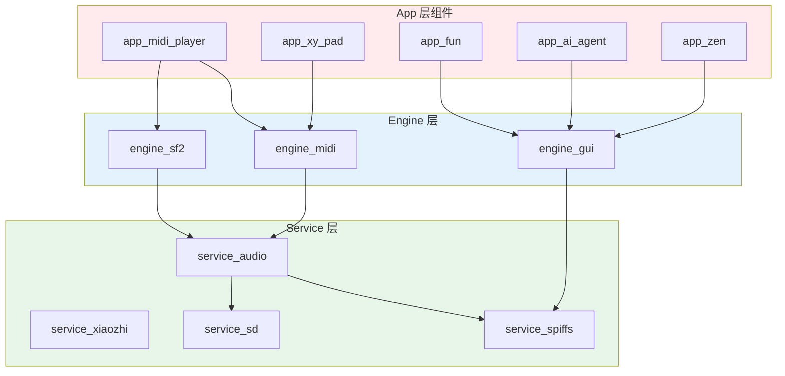

# TAB5_Music_Pad 软件架构图文档

## 1. 整体分层架构

```mermaid
graph TB
    subgraph Layer7 ["Layer 7: UI Frontend - EEZ Studio + LVGL 9.5"]
        UI["GUI 界面<br/>Boot/Launcher/Settings/About"]
        APP["各类 App 界面<br/>Zen/XY Pad/AI Agent/Ear Trainer/<br/>Circle of Fifths/Drum Pad/<br/>MIDI Player/Tiny Piano/<br/>Chord Trainer/Clock Calendar/Fun"]
    end
    
    subgraph Layer6 ["Layer 6: Engine - 纯算法/协议层"]
        MIDI["engine_midi<br/>MIDI 事件总线<br/>发布 - 订阅模式"]
        SF2["engine_sf2<br/>SoundFont 2 采样合成器<br/>32 个 voices"]
        GUI["engine_gui<br/>LVGL 后端驱动<br/>1280×720 DSI 显示"]
    end
    
    subgraph Layer5 ["Layer 5: Service - 硬件服务层"]
        AUDIO["service_audio<br/>44.1kHz 音频混音<br/>软限幅"]
        SD["service_sd<br/>SD 卡文件系统"]
        SPIFFS["service_spiffs<br/>SPIFFS 资源分区"]
        RTC["service_rtc<br/>RTC 实时时钟<br/>农历计算"]
        POWER["service_power<br/>电源管理<br/>C6 控制/电量检测"]
        USB["service_usb<br/>USB Host/Device"]
        WIFI["service_wifi_ble<br/>Wi-Fi/BLE 连接"]
        I2C["service_i2c<br/>I2C 总线通信"]
        NVS["service_nvs<br/>NVS 参数存储"]
        XIAOZHI["service_xiaozhi<br/>XiaoZhi AI<br/>WebSocket/Opus/AEC"]
    end
    
    subgraph Layer4 ["Layer 4: Task - RTOS 任务层"]
        TASK_GUI["task_gui<br/>优先级 10<br/>Core 0<br/>LVGL tick 刷新"]
        TASK_INPUT["task_input<br/>优先级 7<br/>Core 0<br/>触摸事件处理"]
        TASK_COMM["task_comm<br/>优先级 4<br/>Core 0<br/>MIDI/USB 事件处理"]
        TASK_APP["task_app<br/>优先级 4<br/>Core 0<br/>App 生命周期管理"]
        TASK_AUDIO["task_audio<br/>优先级最高<br/>Core 1<br/>音频渲染循环"]
        TASK_AI["task_ai<br/>优先级 5<br/>Core 0<br/>AI 常驻工作循环"]
    end
    
    subgraph Layer3 ["Layer 3: App Manager - 应用管理层"]
        AMGR["app_manager<br/>App 注册表<br/>生命周期<br/>输入路由<br/>异步请求队列"]
    end
    
    subgraph Layer2 ["Layer 2: Application - 业务逻辑层"]
        APP_ZEN["app_zen<br/>禅模式"]
        APP_XY["app_xy_pad<br/>XY 垫"]
        APP_AI["app_ai_agent<br/>AI 助手"]
        APP_EAR["app_ear_trainer<br/>音乐耳训"]
        APP_CIRCLE["app_circle_of_fifths<br/>五度圈"]
        APP_DRUM["app_drum_pad<br/>鼓垫"]
        APP_MIDI["app_midi_player<br/>MIDI 播放器"]
        APP_PIANO["app_tiny_piano<br/>小钢琴"]
        APP_CHORD["app_chord_trainer<br/>和弦训练器"]
        APP_CLOCK["app_clock_calendar<br/>时钟日历"]
        APP_FUN["app_fun<br/>趣味应用<br/>塔罗牌/答案之书"]
    end
    
    subgraph Layer1 ["Layer 1: BSP - 硬件抽象层"]
        ESP32P4["ESP32-P4 SoC<br/>RISC-V 360MHz<br/>32MB PSRAM"]
        ES8388["ES8388 Audio Codec<br/>播放输出"]
        ES7210["ES7210 ×2<br/>MEMS 麦克风<br/>AEC 回声消除"]
        LCD["MIPI-DSI LCD<br/>5 inch 1280x720"]
        TOUCH["GT911 Touch<br/>电容触控"]
        MICROSYS["SDMMC<br/>MicroSD 卡槽"]
        C6["ESP32-C6<br/>Wi-Fi/BLE SDIO"]
    end

    Layer7 --> Layer6
    Layer6 --> Layer5
    Layer5 --> Layer4
    Layer4 --> Layer3
    Layer3 --> Layer2
    Layer2 --> Layer1
    
    style Layer7 fill:#e1f5ff,stroke:#0077be
    style Layer6 fill:#fff4e1,stroke:#bf7700
    style Layer5 fill:#f0f0f0,stroke:#333333
    style Layer4 fill:#e8f5e9,stroke:#2e7d32
    style Layer3 fill:#fce4ec,stroke:#c2185b
    style Layer2 fill:#fff3e0,stroke:#ef6c00
    style Layer1 fill:#ede7f6,stroke:#5e35b1
```


```

## 2. 数据流与控制流

### 2.1 输入事件流程

```
用户触摸 → task_input → engine_gui → task_comm → engine_midi → app_manager → Current App
```

详细数据流：
- 触摸事件 raw data → get_touch_event() → normalized event
- publish input event → engine_midi_publish()
- SysEx format: 0xF0 03 func p1 p2 0xF7
- subscribe MIDI_CMD_INPUT → on_input(event)
- UI 响应反馈

### 2.2 音频渲染路径

```
音源层：engine_sf2 + Aux PCM → 混音处理：音量控制 → Float Stereo Mix → Soft Limiter → 输出层：Int16 Convert → ES8388 DAC → 扬声器/耳机
```

### 2.3 MIDI 事件总线

```
发布者：USB Host HID / BLE MIDI / UART MIDI / USB Device / Application Apps
          ↓
MIDI Event Bus (Event Queue len=128)
          ↓
消费者：engine_sf2(音符触发) / app_manager(SysEx 解析) / MIDI Logger
```

### 2.4 App 生命周期状态机

```
[UNLAUNCHED: 未启动] ──launch()──> [RUNNING]
                                      ├──on_init: 已初始化
                                      ├──on_render: 持续调用
                                      └──on_input: 可响应
           
[RUNNING] ──suspend()/切屏──> [PAUSED: 已挂起]
                                   └──SUSPENDED: 保留上下文

[PAUSED] ──resume()──────────> [RUNNING]
[RUNNING] ──kill()───────────> [UNLAUNCHED]
[PAUSED] ──kill()────────────> [UNLAUNCHED]
```

## 3. 任务调度与时序

### 3.1 FreeRTOS 任务配置

| 任务名称   | 优先级 | Core | 栈大小    | 周期     | 主要职责                  |
|------------|--------|------|-----------|----------|---------------------------|
| task_audio | 最高   | 1    | 8192 byte | 死循环   | 音频渲染 64 frames/周期   |
| task_gui   | 10     | 0    | 8192 byte | 10 ms    | LVGL tick 刷新            |
| task_input | 7      | 0    | 8192 byte | 10 ms    | 触摸事件采集与分发        |
| task_ai    | 5      | 0    | 24576 byte| 队列驱动 | XiaoZhi AI 工作循环       |
| task_app   | 4      | 0    | 8192 byte | 10 ms    | App 生命周期管理 + NVS 提交 |
| task_comm  | 4      | 0    | 8192 byte | 10 ms    | MIDI/USB 事件处理         |


## 4. 关键接口定义

### 4.1 App 基础接口

```c
typedef struct {
    const char* name;                    // App 标识名
    const char* screen_name;             // EEZ 屏幕名称
    void* screen_ctx;                    // 屏幕上下文
    size_t screen_ctx_size;              // 上下文大小
    widget_bind_t* widget_bindings;      // 控件绑定表
    
    // 生命周期回调
    esp_err_t (*on_init)(void);          // 初始化
    void (*on_render)(void);             // 每帧渲染
    void (*on_update)(float dt);         // 逻辑更新
    esp_err_t (*on_pause)(void);         // 挂起前保存
    esp_err_t (*on_resume)(void);        // 恢复时加载
    esp_err_t (*on_destroy)(void);       // 销毁资源
    
    // 输入处理
    void (*on_input)(const app_input_event_t* evt);
    
    // SysEx 事件
    void (*on_sysex)(const uint8_t* msg, size_t len);
    
} app_base_t;
```

### 4.2 MIDI 总线 API

```c
// 发布 MIDI 事件
esp_err_t engine_midi_publish(
    midi_port_t port, 
    const midi_event_t* event
);

// 订阅 MIDI 事件
esp_err_t engine_midi_subscribe(
    engine_midi_consumer_t* consumer,
    midi_callback_fn cb
);

// 取消订阅
void engine_midi_unsubscribe(
    engine_midi_consumer_t* consumer
);
```

### 4.3 SF2 引擎 API

```c
// 加载 SF2 文件
esp_err_t engine_sf2_load_file(const char* filepath);

// 设置加载进度回调
void engine_sf2_set_progress_callback(
    sf2_progress_cb_t cb,
    void* user_data
);

// 注册音效源
esp_err_t engine_sf2_register_source(
    audio_source_id_t id,
    const audio_source_config_t* config
);

// 激活 SF2 为默认音源
esp_err_t engine_sf2_activate(void);
```


### 5.2 PSRAM 使用概览

| 区域           | 大小估算   | 用途描述               |
|----------------|------------|------------------------|
| LVGL 显示缓冲区 | ~180 KB    | 帧缓冲、图层           |
| Flow 运行时状态 | ~50 KB     | 可视化编程状态机       |
| 屏幕上下文      | ~200 KB    | 各 App UI 状态         |
| SF2 采样数据    | ~1.5 MB    | 音色 PCM 缓存          |
| Synth 内部状态  | ~200 KB    | Voice 管态、效果器参数 |
| Aux 环形缓冲    | ~700 KB    | TTS 下行语音 FIFO      |
| 其他临时缓冲    | ~200 KB    | 通用临时数据           |
| **总计**       | **~3.1 MB**| （PSRAM 共 32 MB 可用） |

## 6. 依赖关系矩阵



## 7. 启动流程概览

主流程顺序：
1. service_power_init() 5%
2. engine_midi_init() + app_manager_init()
3. app_manager_register_all() 注册 11 个 App
4. service_sd_init() 32%
5. service_i18n_init() + engine_gui_init() + service_page_init() 20%
6. 启动 task_gui / task_comm / task_app 25%
7. service_rtc_init() 28%
8. service_wifi_init() / task_ai_start() / service_http_client_init() 45%
9. service_input_init() 50%
10. service_audio_init() + SF2 加载 60~99% → 100%

## 8. 安全与限制

### 8.1 架构红线

| 规则 | 说明 | 原因 |
|------|------|------|
| ❌ App 直接调 Service | App → Service/BSP | 违反分层原则，导致耦合 |
| ❌ Task 写业务逻辑 | task_* 包含业务代码 | 任务应是胶水层 |
| ❌ 修改 EEZ 生成文件 | `components/engine_gui/src/ui/*` | 单一可信源是 `.eez-project` |
| ❌ ABBA 死锁 | 在 `request` 路径持 `lifecycle_mutex` + 申请 lvgl 锁 | 互斥条件必然触发死锁 |
| ❌ PSRAM 放在 task_ai | task_ai 栈必须用内部 RAM | NVS 写入禁用 cache 后 PSRAM 不可达 |

### 8.2 已知约束

- **单 USB PHY**: USB Host 和 USB Device 不能同时工作
- **音量上限**: 默认 55/100，需持久化到 NVS
- **SF2 预加载**: 启动时全部载入 PSRAM，播放期零文件 I/O
- **音频独占 Core 1**: Core 1 无 WDT 检查 idle task
- **NVS 明文存储**: Wi-Fi 凭据、xiaozhi token 等未加密

---

*本文档自动生成 | 最后更新：2026-07-28*
